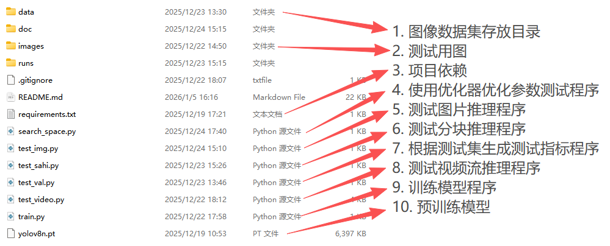
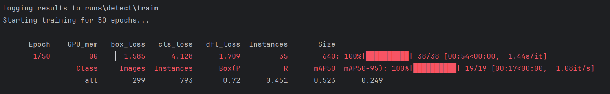
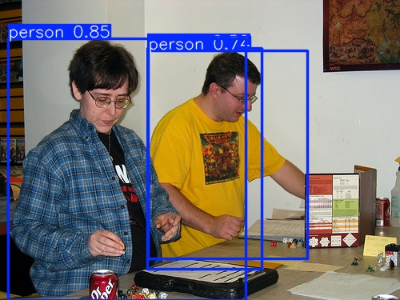
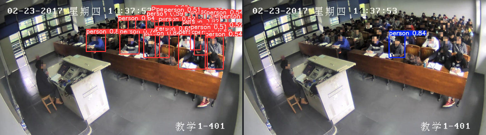
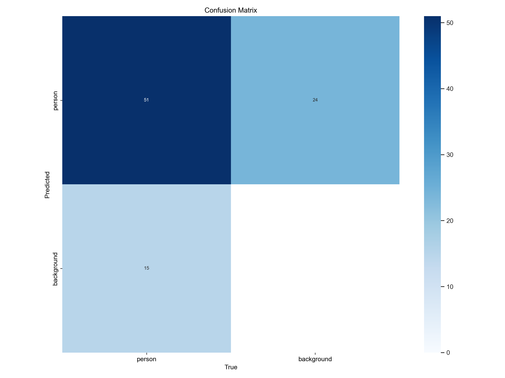
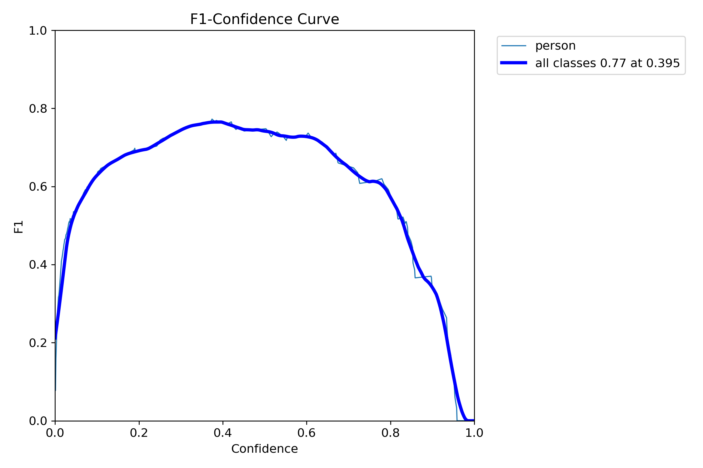
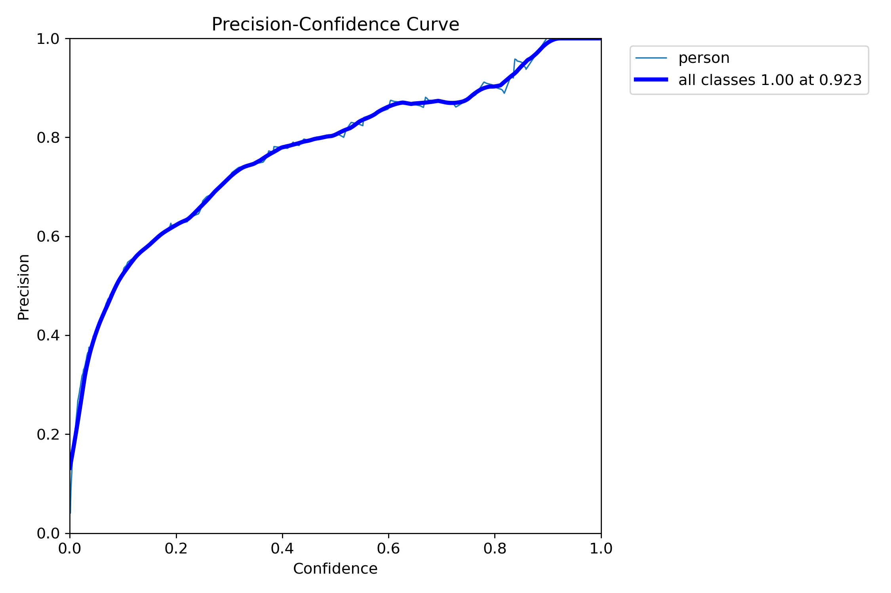
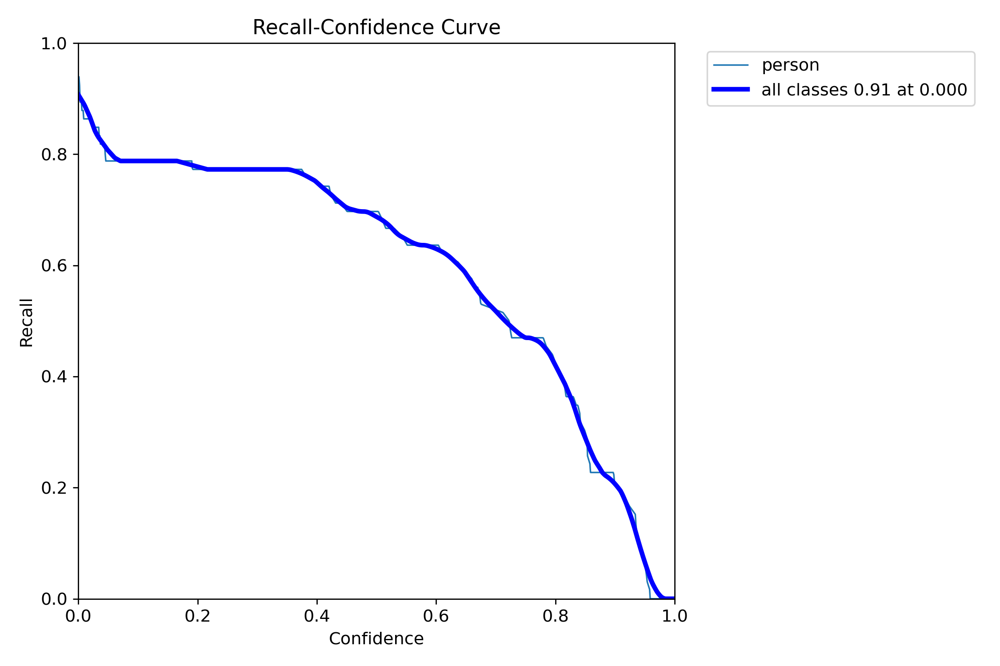
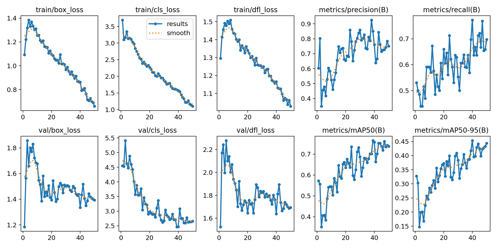

# YOLO模型训练教程和优化思路

## 前言

本教程将从基础环境搭建入手，逐步引导大家完成YOLO模型的训练、测试全流程，并对训练结果进行解读，最后分享实用的优化思路。本教程适合初学者或者是完全不懂的小白，希望能带给大家一点帮助。

> 提示：YOLO官方文档涵盖本篇文章的所有内容，如果大家时间充裕推荐看官方文档进行学习[Ultralytics YOLO 文档](https://docs.ultralytics.com/zh/)。

## 数据集收集建议(重点)

现在 YOLO 模型本身已经很成熟，不用过多调参，模型好坏核心看数据集。简单来说：“喂给模型什么素材，它就能识别什么”。比如训练人头检测却识别不了戴帽子的头部，就是数据集缺这类样本或者样本不足导致泛化能力差；模型把背景误判为目标，多是因为背景样本少、场景覆盖不全。图片质量同样能影响模型整体识别效果。

所以模型优化的核心是数据集优化：训练前要先理清目标的所有应用场景，针对性收集素材，确保素材库覆盖绝大多数场景，才能让模型学到完整的目标特征。

> 数据集素材采集核心注意事项

1. **光照条件多样化**：覆盖夜间灯光直射、黄昏微光、清晨逆光、正午强光等不同光照场景。
2. **目标摆放姿态全面**：包含平放、倾斜放置、躺倒放置等多种姿态，贴合实际工况下的目标形态。
3. **拍摄视角全覆盖**：采集水平正视、高空俯视、斜向下侧视等不同角度的样本，避免视角单一导致的模型识别偏差。
4. **应用场景无遗漏**：依据目标的真实作业场景，逐一覆盖所有实际应用环境，确保样本场景的完备性。
5. **目标尺度差异化**：纳入近景（大尺寸）、中景（标准尺寸）、远景（小尺寸）的样本，提升模型对不同尺度目标的检测能力。
6. **遮挡场景针对性采集**：模拟实际场景中可能出现的遮挡物及遮挡程度，补充部分遮挡、重度遮挡等类型的样本。
7. **多目标共存场景补充**：结合作业场景，采集多类型目标同时出现在画面中的样本，适配真实检测环境下的多目标识别需求。

## 基础环境

基础环境如下：

- Python环境：Python 3.9.21
- 核心依赖库：

```sh
# sahi==0.11.36，非必须，测试分块推理时需要
ultralytics==8.3.76
ffmpeg-python==0.2.0
opencv-python==4.6.0.66
numpy==1.26.4
```

- 视频处理工具(**非必须，测试视频流推理需要**)：ffmpeg7.0.2 用于视频流的解码、编码，配合视频测试脚本使用
- 流媒体服务工具(**非必须，测试视频流推理需要**)：mediamtx_v1.11.2_windows_amd64 Windows系统下的流媒体服务器

## 准备阶段

在正式训练模型前，需完成源代码获取、Python环境配置以及项目目录熟悉。

### 代码准备

本教程使用的YOLOv8训练项目源码已托管至GitHub，可直接下载获取：

- GitHub仓库地址：[yolov8-train](https://github.com/ObjectKjq/yolov8-train)
- 源码直接下载链接：[下载源码](https://codeload.github.com/ObjectKjq/yolov8-train/zip/refs/heads/master)

下载完成后，将压缩包解压至本地指定目录。

### 安装环境

推荐使用conda创建独立的Python环境，避免与其他项目的依赖包冲突。若未安装conda，也可直接使用官方Python安装包配置环境。

1. 基于conda创建环境（推荐）

```sh
# 创建名为yolov8-train的Python环境，指定Python版本为3.9.21
conda create -n yolov8-train python=3.9.21
```

接下来需要安装PyTorch框架（YOLOv8模型训练的核心依赖），需根据自身显卡型号选择对应版本的PyTorch，具体可参考PyTorch官方指南：[Get Started](https://pytorch.org/get-started/locally/)

```sh
# 进入项目根目录打开控制台，进入当前conda的yolov8-train环境
conda activate yolov8-train
# 安装PyTorch，我这里使用CPU做测试
pip install torch torchvision
# 下载训练模型所需要的依赖
pip install -r requirements.txt
```

2. 无conda环境配置

若未安装conda，可直接下载官方Python 3.9.21安装包：[Windows 版 Python 版本](https://www.python.org/downloads/windows/)，完成安装后，直接通过pip命令安装上述PyTorch及项目依赖包即可。

### 目录文件说明

项目解压后，各目录与文件承担不同的功能，熟悉目录结构有助于后续数据准备、脚本运行等操作。项目目录与文件结构如下：



## 训练模型

### 数据准备

项目的data目录用于存放模型训练所需的数据集，我这里准备了300多张数据集提供大家测试。data目录下默认包含训练集、验证集和测试集三个子目录，以及data.yaml配置文件，说明如下：

- train：训练集，存放用于模型训练的图像及对应的标签文件
- val：验证集，用于在训练过程中评估模型性能，指导模型参数优化
- test：测试集，用于训练完成后测试模型的泛化能力，测试集主要在训练完成后验证模型，在训练过程中不起作用

> 注意：图像文件与标签文件需一一对应，标签格式需符合YOLO系列模型的要求，常见的标注工具有Label Studio、LabelImg、CVAT等等，更多内容请参见官方文档[计算机视觉的数据收集和标注策略](https://docs.ultralytics.com/zh/guides/data-collection-and-annotation/#techniques-of-annotation)。

### 修改配置文件

data.yaml文件用于指定数据集路径、类别数量及类别名称，是模型训练的核心配置文件之一，需根据实际数据集情况修改：

```yml
# 修改为你自己的目录
train: C:\Users\kjq\Desktop\yolov8-train\data\train\images
val: C:\Users\kjq\Desktop\yolov8-train\data\val\images
test: C:\Users\kjq\Desktop\yolov8-train\data\test\images

# 类别数量
nc: 1

# 配置序号对应类别的名称
names:
  - 'person'
```

### 配置train.py训练参数并启动

train.py文件包含模型加载、训练参数设置及训练启动逻辑，可根据自己设备情况和训练需求调整参数。

```python
from ultralytics import YOLO

model = YOLO('./yolov8n.pt') # 加载预训练模型

model.train(
    data='./data/data.yaml', # 数据集配置文件路径
    epochs=50, # 训练轮次，根据需求更改
    imgsz=640,
    # device='0',
    device='CPU', # 训练模型用的设备类型。0表示GPU
    batch=8, # 训练模型的批次大小，根据自己设备和需求动态调整

    # 其它参数.....
    # cls=True, # 类别权重自动平衡
    # augment=True,  # 开启参数增强
    # hsv_h=0.2,  # 色调扰动，默认值0.015
    # hsv_s=0.7,  # 饱和度扰动，默认值0.7
    # hsv_v=0.5,  # 亮度扰动，默认值0.4
    # degrees=10.0,  # 随机旋转角度（±15°）,默认0.0
    # translate=0.0, # 关闭随机平移
    # scale=0.3,  # 随机缩放模拟远近,默认0.5
    # shear=5.0,  # 形变30度,默认0.0
    # flipud=0.5,  # 上下翻转，默认0.0
    # fliplr=0.5,  # 左右翻转，默认0.5
    # mosaic=1.0,  # 马赛克增强，默认1.0
    # mixup=0.3,  # 图像混合，默认值0.0
    # cutmix=0.2, # 混合图像部分区域，默认值0.0
    # copy_paste=0.2, # 复制粘贴增强，默认值0.0.和上面效果基本一样,之不过他是随机复制,上面是相同位置
)
```

更多训练参数请参见官方文档[使用 Ultralytics YOLO 进行模型训练 - Ultralytics YOLO 文档](https://docs.ultralytics.com/zh/modes/train/#train-settings)，参数配置完成后，在项目根目录的控制台中执行以下命令启动训练：

```sh
python ./train.py
```

训练启动后，控制台会输出训练进度、损失值、评估指标等信息，同时在runs/detect/train目录下生成训练日志和模型文件。训练过程图示如下：



## 简单测试

模型训练完成后，会在项目根目录生成runs/detect/train文件夹，这里我就通过图像、视频流等多种方式测试模型性能，验证模型的检测效果。本项目提供了3个测试脚本，分别适用于不同的测试场景，具体操作如下：

### 图像推理测试（test_img.py）

```python
# 加载模型
model = YOLO("./runs/detect/train/weights/best.pt")  
print(f"检测类别: {model.names}")
# 执行检测并保存结果（默认存到runs/detect/predict）
model.predict(source='./images/2008_002378.jpg', save=True, conf=0.6)
```

运行脚本后，检测结果默认保存至runs/detect/predict目录，可查看检测图像，观察目标框的准确性。



### 视频流推理测试（test_video.py）

该脚本支持摄像头实时视频流推送，需配合ffmpeg和mediamtx工具使用，适用于动态目标检测场景：

```python
# 视频源地址配置（0表示笔记本内置摄像头，也可替换为RTSP流地址，如\"rtsp://xxx.xxx.xxx.xxx:554/stream\"）
cap = cv2.VideoCapture(0)

# 推流地址配置（修改为mediamtx服务的RTSP地址，默认本地地址为rtsp://localhost:8554/camera2）
process = ffmpeg.input('pipe:', format='rawvideo', pix_fmt='bgr24', s=f'{width}x{height}',
                 r=fps).output(
        "rtsp://localhost:8554/camera2" # 这里改成自己mediamtx地址
    ).overwrite_output().run_async(
        pipe_stdin=True
    )
```

> 注意：启动视频流推理之前一定确保自己电脑上有[下载FFmpeg](https://ffmpeg.org/download.html)与[下载mediamtx](https://github.com/bluenviron/mediamtx/releases/tag/v1.11.2)，命令运行ffmpeg检查版本。

```python
# 启动程序
python ./test_video.py
```

启动后，可通过浏览器访问mediamtx提供的WebRTC接口查看检测结果：http://localhost:8889/camera2/（8889为mediamtx默认的WebRTC访问端口）。mediamtx支持多种访问接口，可根据需求选择。

### 分块推理测试（test_sahi.py）

SAHI分块推理技术，适用于大尺寸图像或小目标检测场景。**通过将图像分块后分别推理，再融合结果，可提升小目标的检测精度，但相应的会消耗更多GPU资源**，具体可以参考官方文档[Ultralytics 文档：将 YOLO11 与 SAHI 结合使用于切片推理](https://docs.ultralytics.com/zh/guides/sahi-tiled-inference/)。使用方式可参考脚本内部注释，直接运行即可：

```sh
python ./test_sahi.py
```

下面是普通推理和分块推理对比图，左边为分块推理，右边是普通推理，可以看到明显分块推理能识别更多目标。根据自己需求进行选择推理方式，实际情况还要考虑图像分辨率。



## 训练结果

### 核心性能指标

模型训练完成后，在runs/detect/train目录下会生成训练日志、性能指标曲线、混淆矩阵等结果文件。要正确解读训练结果，需先理解核心性能指标，再结合生成的图表分析模型性能。

- **精确率(Precision)**: 模型预测为“正例”的结果中，实际是正例的比例。用于评估模型避免假阳性（误报）的能力，准确率越高，误报越少。
- **召回率(Recall)**: 实际是正例的样本中，被模型正确预测的比例。用于评估模型避免假阴性（漏报）的能力，召回率越高，漏报越少。
- **置信度(Confidence)**：模型对预测结果的信任程度，置信度可调整，用于筛选可靠的检测结果。
- **交并比 (IoU):** IoU 是一种量化预测边界框与真实边界框之间重叠程度的度量。
- **平均精度 (AP)：**AP 计算精度-召回曲线下的面积，提供一个单一值，概括了模型的精度和召回性能。
- **平均精度均值 (mAP):** mAP 通过计算多个对象类别的平均 AP 值来扩展 AP 的概念。这在多类对象 detect 场景中非常有用，可以提供对模型性能的全面评估。
- **mAP50**: 在交并比 (IoU) 阈值为 0.50 时计算的平均精度均值。它衡量了模型在仅考虑“简单”检测时的准确性。
- **mAP50-95**: 在 0.50 到 0.95 范围内的不同 IoU 阈值下计算的平均精度均值。它全面反映了模型在不同检测难度下的性能。
- **F1 分数：** F1 分数是精度和召回率的调和平均值，在考虑假正例和假负例的同时，对模型的性能进行均衡评估。

更多性能指标请参见官方文档[性能指标深入分析 - Ultralytics YOLO 文档](https://docs.ultralytics.com/zh/guides/yolo-performance-metrics/)

### 使用test测试集生成指标

为什么需要test测试集生成性能指标？

> 我们训练 YOLOv8 后，在`runs/detect/train`目录下生成的所有性能指标，均是基于**验证集 (val)**计算得到的。而验证集在模型训练流程中，承担的核心作用是**指导模型训练方向、参与训练策略迭代**：训练的每一个轮次结束后，都会用验证集评估当前模型效果，并基于验证集的表现反向调整模型的权重参数、学习率等训练策略。正因为验证集全程参与了模型的训练优化过程，模型会在训练中不断 “适配” 验证集的特征分布，因此**模型在验证集上的性能指标存在一定的偏向性，无法客观、真实地反映模型的泛化能力，该指标结果不具备绝对的说服力**。

```python
from ultralytics import YOLO

model = YOLO("./runs/detect/train/weights/best.pt")

# 评估test集（核心：split='test'）
results = model.val(
    data="./data/data.yaml",  # 替换为你的数据配置文件路径
    split="test",        # 明确指定评估test集（默认是val）
    save_json=False,     # 可选：保存评估结果为JSON文件（便于后续分析）
    plots=True           # 必选：开启绘图（生成P/R/F1曲线等）
)
```

运行测试，最终会在runs/detect/val目录下生成指标。

```sh
python ./test_val.py
```

### 训练结果图表解读

#### 混淆矩阵



混淆矩阵的核心是 “预测类别” 与 “真实类别” 的匹配情况：

- 行（左侧）：模型**预测的类别**（`person`/`background`）
- 列（下方）：样本**真实的类别**（`person`/`background`）

| 预测 \ 真实 | person（真实是人） | background（真实是背景） |
| ----------- | ------------------ | ------------------------ |
| person      | 51（真阳性，TP）   | 24（假阳性，FP）         |
| background  | 15（假阴性，FN）   | 0（真阴性，TN）          |

- 对 “person” 的漏检较多：真实是人的样本中，有 15 个被错误预测成了背景。
- 对 “person” 的错误较多：真实是背景的样本中，有24个背景被错误监测成"person"。

#### F1分数曲线



这张图里的F1是 F1分数，是评估模型检测性能的核心指标之一。

- 横轴：模型预测结果的置信度（0到1，越高代表模型对预测结果越 “确定”）
- 纵轴：对应置信度下的 F1分数（F1是精确率和召回率的综合指标，越高代表模型性能越好）

它是精确率（Precision）和召回率（Recall）的调和平均数，公式为：`F1=2 × [(Precision+Recall) / (Precision×Recall)]`

F1 分数的取值范围是0~1，越接近 1 说明模型在 “精确率” 和 “召回率” 之间的平衡越好。

此图展示置信度敏感度过高：当置信度超过 0.4 后，F1 分数快速下降；到置信度 1.0 时 F1 直接降到 0，说明模型对 “高置信度预测” 的准确性很差，要么是高置信度的预测大量出错，要么是高置信度的样本极少。

#### 精确率曲线



这是精确率 - 置信度曲线，用来展示 “模型预测置信度” 和 “精确率” 的关系：

- 横轴：模型预测结果的置信度（0 到 1，置信度越高，模型对预测结果的 “确定性” 越强）
- 纵轴：对应置信度下的精确率（精确率 = 预测正确的正样本数 / 所有预测为正的样本数，反映 “预测为某类的结果里，真正是该类的比例”）

这张图反应了**高置信度下精确率表现好**，当置信度≥0.923 时，精确率能达到 1.0，说明模型对 “高置信度的预测” 准确性很高。**低置信度下精确率差**：置信度＜0.2 时，精确率接近 0，说明低置信度的预测大部分是错误的。

#### 召回率曲线



这是召回率 - 置信度曲线，展示 “模型预测置信度” 和 “召回率” 的关系：

- 横轴：模型预测的置信度（0 到 1，置信度越高，模型对预测结果越确定）
- 纵轴：对应置信度下的召回率（召回率 = 预测正确的正样本数 / 所有真实正样本数，反映 “真实的目标里，被模型成功识别出来的比例”）

**置信度与召回率负相关**，置信度从 0 升到 1 的过程中，召回率从 0.91 快速下降到 0，说明高置信度下模型会漏掉大量真实样本，低置信度才能覆盖更多真实目标。**与精确率曲线矛盾**，低置信度召回率高，但精确率极低，背景误判多；高置信度精确率高，但召回率极低，目标漏检多，模型在 “覆盖更多目标” 和 “预测更准确” 之间的平衡很差。

#### 训练结果曲线集



首先说明这张图的含义：这是 Yolov8 训练过程中的损失与指标曲线汇总图，包含训练 / 验证阶段的损失、以及模型性能指标，横轴是训练轮次。

各子图的核心含义：

- `train/val/box_loss`：预测框位置的损失（值越低，框定位越准）
- `train/val/cls_loss`：类别预测的损失（值越低，类别判断越准）
- `train/val/df_loss`：分布焦点损失（辅助框和类别预测的损失）
- `metrics/precision/recall`：精确率 / 召回率（值越高，性能越好）
- `metrics/mAP50/mAP50-95`：平均精度（mAP50 是 IoU=0.5 时的精度，mAP50-95 是多 IoU 下的平均，值越高性能越好）

分析训练结果：

1. 训练损失正常下降，但验证损失波动大：训练的 box/cls/df_loss 都在持续降低（说明模型在训练集上学到了特征），但验证损失（val/*_loss）波动明显（尤其是后期），说明模型泛化能力弱，对验证集的适配性差。
2. 性能指标（精确率 / 召回率 /mAP）波动大：这些指标在训练过程中上下震荡（没有稳定上升），说明模型训练不稳定，或者数据分布有问题（比如背景样本少、标注噪声）。
3. 最终 mAP 指标不高：mAP50 最终大概在 0.7 左右，mAP50-95 在 0.4 左右，核心问题还是 类别不平衡导致模型性能受限。

## 优化思路

若模型训练结果未达到预期（如检测精度低、漏报误报多、推理速度慢等），可从超参数、数据集、模型结构、部署等多个维度进行优化。具体优化方向如下：

### 超参数优化

超参数直接影响模型的训练过程和性能，合理调整超参数可显著提升模型效果。超参数调优也要根据场景和数据集进行调优，

建议参考Ultralytics官方超参数调整指南：[Ultralytics YOLO 超参数调整指南 - Ultralytics YOLO 文档](https://docs.ultralytics.com/zh/guides/hyperparameter-tuning/)。

**我们也可以使用 `model.tune()` 方法，使用AdamW优化器进行自动优化**

```python
from ultralytics import YOLO

# Initialize the YOLO model
model = YOLO("yolov8n.pt")

# 优化器会在这里指定的搜索空间中选值
# search_space = {
#     "lr0": (1e-5, 1e-1),
#     "degrees": (0.0, 45.0),
# }

# 调整超参数，训练 50 个周期。如果不指定space参数范围，会使用默认的https://docs.ultralytics.com/zh/guides/hyperparameter-tuning/#default-search-space-description
model.tune(
    data='./data/data.yaml',
    epochs=50,
    iterations=10, # 生成多少组参数优化
    optimizer="AdamW",
    # space=search_space,
)
```

最终生成优化结果，best_hyperparameters.yaml 文件包含在调整过程中找到的最佳性能超参数。您可以使用此文件来初始化具有这些优化设置的未来训练。详细情况请参考官方文档[Ultralytics YOLO 超参数调整指南 - Ultralytics YOLO 文档](https://docs.ultralytics.com/zh/guides/hyperparameter-tuning/#resuming-an-interrupted-hyperparameter-tuning-session)

```
runs/
└── detect/
    ├── train1/
    ├── train2/
    ├── ...
    └── tune/
        ├── best_hyperparameters.yaml
        ├── best_fitness.png
        ├── tune_results.csv
        ├── tune_scatter_plots.png
        └── weights/
            ├── last.pt
            └── best.pt
```

### 数据集优化

数据集是模型训练的基础，数据集的质量直接决定模型性能。优化方向如下：

- 数据扩充：增加数据集样本数量，覆盖更多场景（如不同光照、角度、背景），可通过数据增强、收集真实场景数据等方式实现。
- 数据清洗：删除模糊、标注错误、重复的样本，修正不准确的边界框标注，提升数据集质量。
- 类别平衡：若存在类别不平衡问题（部分类别样本过少），可采用过采样（增加少数类样本）、欠采样（减少多数类样本）、类别权重调整等方法解决。
- 添加测试集：补充独立的测试集，更准确地评估模型的泛化能力，避免因验证集过拟合导致的性能误判。

### 模型结构优化

根据实际应用场景选择合适的模型结构，平衡检测精度和速度：

- 选择轻量级模型：若需部署在边缘设备，可选择YOLOv8n、YOLOv8s等轻量级模型，牺牲少量精度换取更快的推理速度。
- 模型融合：将多个训练好的模型进行融合，提升检测精度）。
- 迁移学习：若数据集较小，可使用更大的公开数据集预训练模型，再基于自有数据集进行微调，提升模型性能。

### 部署优化

若模型用于实际部署，需优化推理速度和资源占用：

- 模型导出优化：将PyTorch模型导出为ONNX、TensorRT等格式，利用TensorRT等工具进行量化（INT8量化）、加速推理。
- 推理参数优化：调整推理时的图像尺寸、置信度阈值、NMS阈值等，在满足精度要求的前提下提升推理速度。
- 硬件适配：根据部署硬件选择合适的模型和加速方案（如GPU部署用TensorRT，CPU部署用OpenVINO）。

更多选项请参考官方文档[YOLO11 部署选项的对比分析](https://docs.ultralytics.com/zh/guides/model-deployment-options/)

